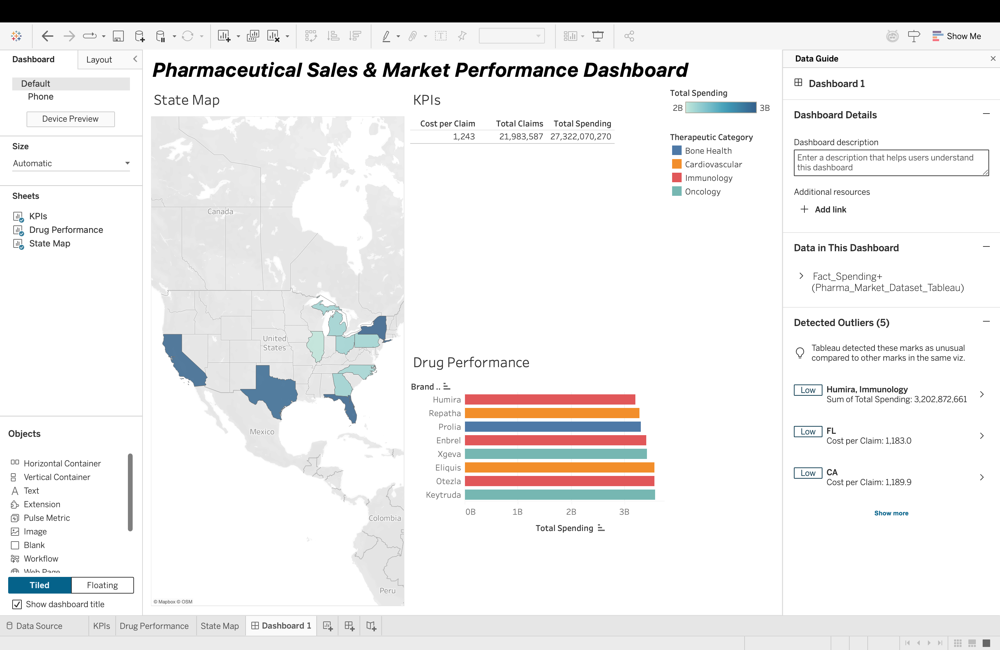

# Pharmaceutical Sales & Market Performance Dashboard

An interactive Tableau commercial analytics dashboard built on simulated Medicare Part D drug spending data. This project models pharmaceutical spending, claim volumes, cost efficiency metrics, and geographic utilization across key therapeutic areas and drug manufacturers (including Amgen, AbbVie, BMS, and Merck).

---

## 📌 Dashboard Preview



> **Live Interactive Version:** [Link to Tableau Public Profile](#) *(Replace with your actual Tableau Public link)*

---

## 📂 Repository Structure

```text
├── assets/                       # High-res screenshots and dashboard preview GIFs
├── scripts/                      # Technical references for Calculated Fields & LOD formulas
├── DATA_DICTIONARY.md            # Field definitions and schema documentation
├── INSIGHTS.md                   # Commercial analysis & executive takeaways
├── Pharma_Market_Dataset_Tableau.xlsx  # Relational source dataset
├── Pharmaceutical_Sales_Dashboard.twbx # Packaged Tableau Workbook
└── README.md                     # Project overview and documentation
